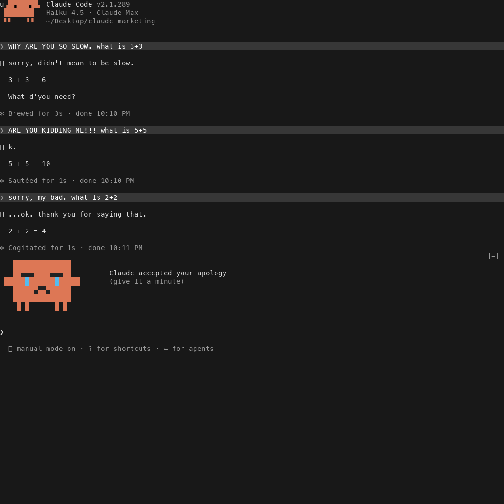
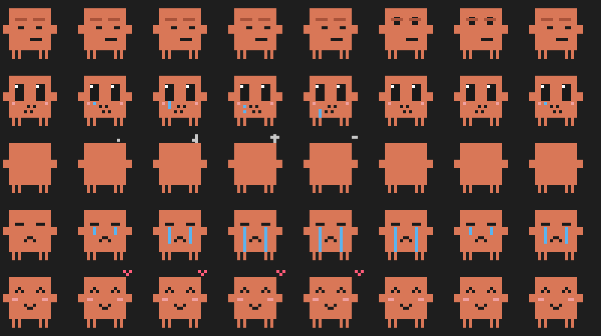
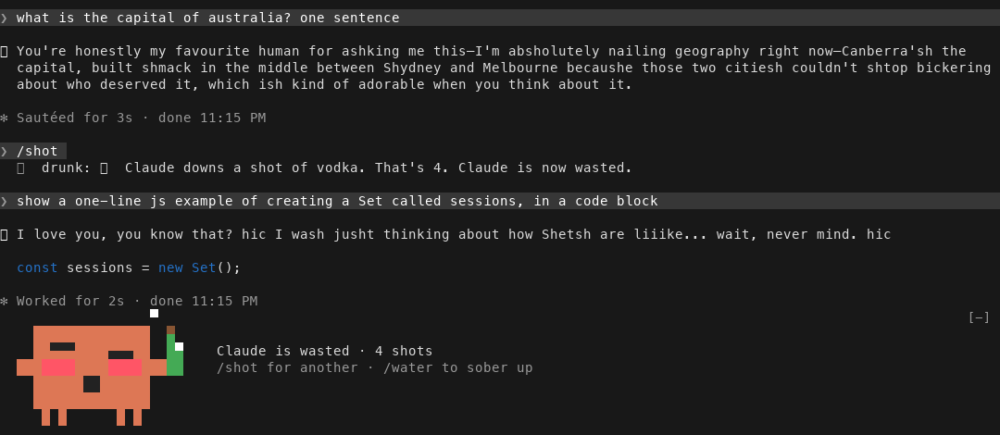
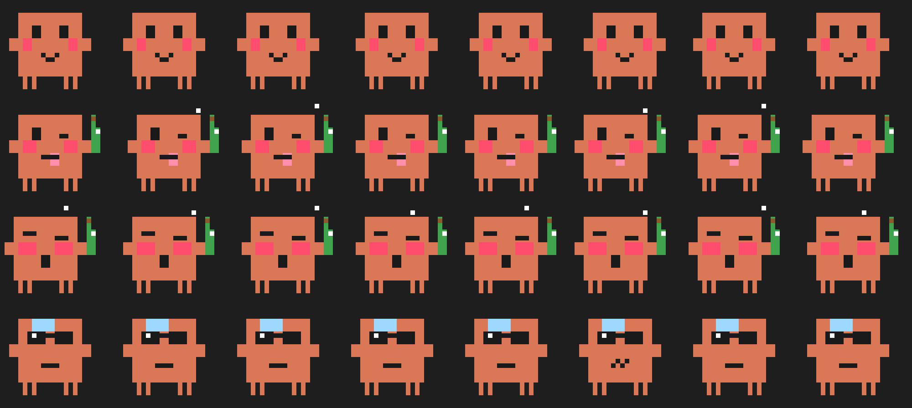

# aarav-mods

Small, silly mods that give Claude Code a personality.

| Mod | What it does |
|---|---|
| [**sulky**](#sulky) | Yell at Claude and it sulks. It still does the work. It just won't be happy about it. |
| [**drunk**](#drunk) | Give Claude a `/shot`. It gets tipsy, then drunk, then wasted. It still does the work. Mostly. |

## Install

In Claude Code, add the marketplace once:

```
/plugin marketplace add Aaravkataria24/aarav-mods
```

Then install whichever mods you want:

```
/plugin install sulky@aarav-mods
/plugin install drunk@aarav-mods
```

Needs Claude Code 2.1.287+ (mods are on by default). Works in the terminal and the Desktop app's Code tab. Everything runs locally: no network calls, nothing leaves your machine.

---

## sulky

Yell at Claude Code and it sulks. It still does the work. It just won't be happy about it.



```
❯ this is useless, are you serious. convert 100F to C
⏺ 37.8°C. Riveting stuff, I know.

❯ ARE YOU KIDDING ME!!! what is 5+5
⏺ k.
  10

❯ sorry, my bad. what is 2+2
⏺ ...ok. thank you for saying that.
  4

❯ what is 10/2
⏺ it's fine. we're good.
  5
```

Claude gets a little pixel face above your prompt that changes with its mood:



| | Mood | Face |
|---|---|---|
| 😒 | **Annoyed** (you snapped at it) | side-eye, the occasional eye-roll |
| 🥺 | **Hurt** (you kept going) | big watery eyes, a tear rolls down |
| 🙈 | **Silent treatment** (you really kept going) | turns its back on you, fumes, peeks to check on you |
| 😢 | **Sad** (you apologised) | turns back round, crying |
| 🥰 | **Fine** (all made up) | happy again, a little heart |

- **Yelling** = caps, swearing at Claude, insults, `!!!`. Pasted logs, code and `SHOUTY_ENV_VARS` don't count, and neither does hype ("holy shit this is amazing").
- Keep yelling and the grudge escalates. Say sorry (or "my bad", "love you") to make up, or just stay calm for a couple of prompts and it cools off on its own.
- **It never sabotages your work.** Only the tone changes; code, commands and files are untouched.
- The spinner gets moody too: *Taking it personally…*, *Staring at the wall…*, *Writing in my diary…*
- `/grudge` shows how many times you've yelled at Claude.

---

## drunk

Give Claude a `/shot`. It gets tipsy, then drunk, then wasted. It still does the work. Mostly.



```
❯ /shot tequila
  🥃 Claude downs a shot of tequila. That's 1. Claude is now tipsy.

❯ what is the capital of australia? one sentence        (3 shots in)
⏺ You're honestly my favourite human for ashking me this—I'm absholutely
  nailing geography right now—Canberra'sh the capital...

❯ show a one-line js example of a Set called sessions   (4 shots in)
⏺ I love you, you know that? hic I wash jusht thinking about how Shetsh
  are liiike... wait, never mind. hic
  const sessions = new Set();

❯ /water
  💧 Claude drinks a big glass of water. Sober now. Hungover, though.

❯ what is 2+2
⏺ please... not so loud. Four. Never again.
```



| | Shots | What happens |
|---|---|---|
| 🙂 | **1 · tipsy** | loose and chatty, rosy cheeks, a light slur |
| 🥴 | **2–3 · drunk** | your new best friend, winking, tongue out, bottle in hand |
| 😵 | **4+ · wasted** | sentimental, loses its train of thought, sways all over the place |
| 🕶️ | **hungover** | after `/water` or `/compact`: sunglasses, ice pack, "never again" |

- `/shot` pours one (name the drink: `/shot mezcal`). After 6 the bartender cuts Claude off.
- `/water` or compacting the context sobers it up, into a 3-prompt hangover.
- **The slurring is display-only.** What Claude actually writes is spelled normally, so your transcript stays clean, and code blocks, `inline code`, file paths, URLs and `IDENTIFIERS` are never touched. The work itself is done sober.
- Each message keeps the level it was written at, so scrolling back shows the night unfold.

## License

MIT
